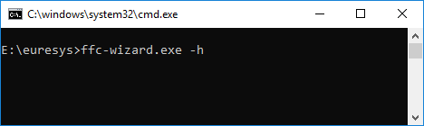
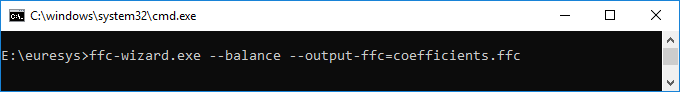
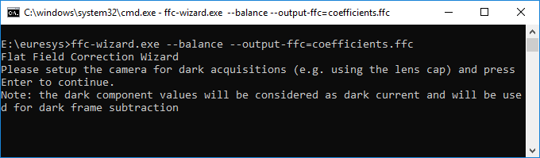
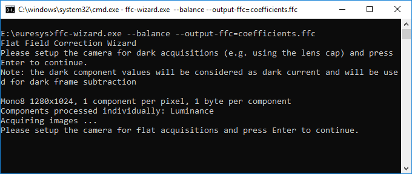
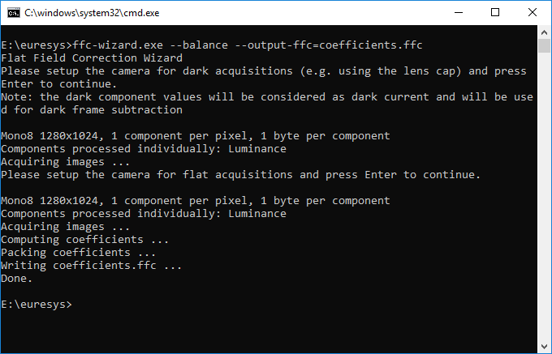
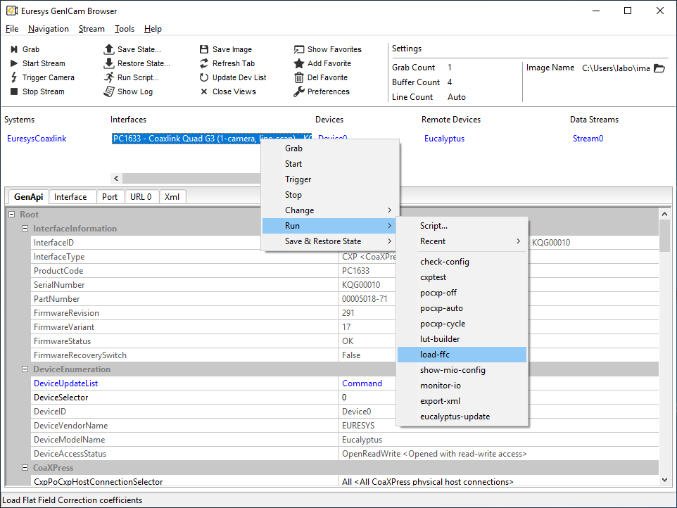
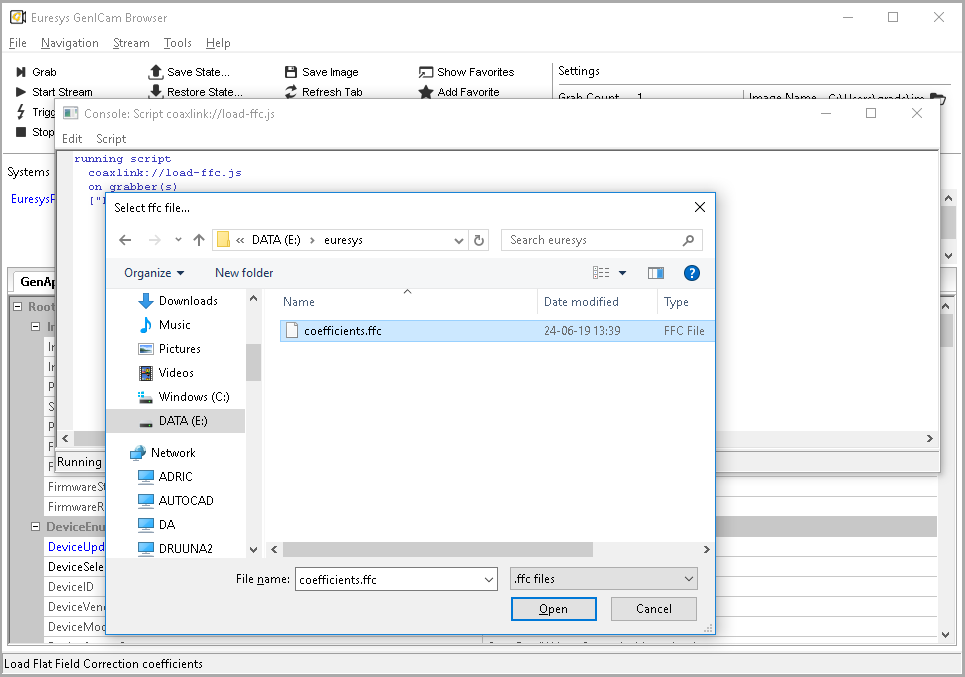

Flat Field Correction
=====================

The Flat-field correction
([FFC](http://en.wikipedia.org/wiki/Flat-field_correction "Flat-field correction"))
is a method used to correct:

-   the differences of light sensitivity between the pixel sensors of a
    camera
-   some artifacts related to the optical system (e.g., non-uniform
    lighting and
    [vignetting](http://en.wikipedia.org/wiki/Vignetting "Vignetting"))

The goal is to correct the pixels of the captured (raw) images in such a
way that when a uniform background is captured by the system (camera &
lens), the resulting output image is uniform.

Formula
-------

This correction is achieved by applying the following operation to each
pixel of the raw image:

> `CorrectedPixel = (RawPixel - Offset) * Gain`

> where both coefficients `Offset` and `Gain` are specific values for
> each pixel.

The evaluation of the coefficients `Offset` and `Gain` requires a
[calibration](#calibration) procedure explained in the next paragraph.

Calibration
-----------

The calibration procedure to compute the coefficients is done in two
steps:

1.  **Dark image acquisition**

    A dark image is acquired[^1] by the system. This is typically
    achieved by covering the lens with the cap. The captured image
    represents the [dark
    current](http://en.wikipedia.org/wiki/Dark_current_(physics) "Dark current")
    of the sensors, and is considered as a fixed bias that we want to
    eliminate when acquiring images in normal conditions. This
    correction is called [dark-frame
    subtraction](http://en.wikipedia.org/wiki/Dark-frame_subtraction "Dark-frame subtraction").

    > `CorrectedPixel = RawPixel - DarkPixel`

    For each pixel, the `DarkPixel` value corresponds to the `Offset` in
    the above
    [FFC](http://en.wikipedia.org/wiki/Flat-field_correction "Flat-field correction")
    [formula](#formula).

2.  **Flat image acquisition**

    A flat image is acquired[^2] by the system. For example by capturing
    a flat (uniform) background, not too bright to avoid saturation and
    not too dark.

    From dark and flat acquisitions, we have enough data to compute the
    `Gain` value of the
    [FFC](http://en.wikipedia.org/wiki/Flat-field_correction "Flat-field correction")
    [formula](#formula).

    For this we define `CorrectedPixel` as the pixel value we consider
    to be correct for the flat image. Let's set this value as the
    average pixel value of the flat image (`average(Flat)`),
    corrected[^3] by the average of the dark image (`average(Flat)`). In
    the
    [FFC](http://en.wikipedia.org/wiki/Flat-field_correction "Flat-field correction")
    [formula](#formula) terms, this gives:

    > `average(Flat) - average(Dark) = (FlatPixel - DarkPixel) * Gain`

    This leads to the `Gain` value

    > `Gain = (average(Flat) - average(Dark)) / (FlatPixel - DarkPixel)`

    The same computation is repeated (`width` \* `height`) times, to
    cover all pixels of both flat and dark images. This results in a
    specific correction for each pixel of the image.

**Note:** this [calibration](#calibration) procedure must be redone if
any part of the system is changed, including the camera unit, lighting
or optics equipment.

### Color Pixel Formats {#color}

For color pixel formats, we have several ways of computing the value of
`average(Flat)`. In all cases, the `Gain` computation is repeated
(`width` \* `height` \* `componentsPerPixel`) times to cover all pixel
components, which results in specific corrections for each pixel
component of the image.

#### Handling pixel components individually

I.e. in `RGB`:

-   using `average(Flat[Red])` for computing the `Gain` values of `Red`
    components;
-   using `average(Flat[Green])` for computing the `Gain` values of
    `Green` components;
-   using `average(Flat[Blue])` for computing the `Gain` values of
    `Blue` components.

#### Handling pixel components together {#balance}

I.e. in `RGB`, using
`average(average(Flat[Red]), average(Flat[Green]), average(Flat[Blue]))`
for computing the `Gain` values of `Red`, `Green` and `Blue` components.

This way of computing the average (i.e. over the pixel components)
results in FFC coefficients that also correct the balance between
components. Therefore, depending on the quality of the uniform
background used to acquire the flat image, the
[FFC](http://en.wikipedia.org/wiki/Flat-field_correction "Flat-field correction")
can effectively perform a white balance correction.

Coaxlink
========

Some cameras have a built-in
[FFC](http://en.wikipedia.org/wiki/Flat-field_correction "Flat-field correction")
module while other cameras do not implement this feature. The devices
without that functionality can however be corrected by the
[FFC](http://en.wikipedia.org/wiki/Flat-field_correction "Flat-field correction")
core of the
[Coaxlink](http://www.euresys.com/Products/Frame-Grabbers/Coaxlink-series "Coaxlink series")
card[^4].

The
[FFC](http://en.wikipedia.org/wiki/Flat-field_correction "Flat-field correction")
core of the
[Coaxlink](http://www.euresys.com/Products/Frame-Grabbers/Coaxlink-series "Coaxlink series")
firmware corrects the pixels directly coming from the camera by applying
the
[FFC](http://en.wikipedia.org/wiki/Flat-field_correction "Flat-field correction")
[formula](#formula) using the coefficients (`Offset` and `Gain`)
corresponding to their locations in the image. Because the correction
happens at a very early stage in the
[Coaxlink](http://www.euresys.com/Products/Frame-Grabbers/Coaxlink-series "Coaxlink series")
pixel processing chain, the other pixel processing functions such as
`RedBlueSwap`, `LUT`, and `Bayer Decoding` are performed on corrected
pixels.

Coefficient format
------------------

The coefficients calculated in the [calibration](#calibration) procedure
can be loaded into the
[Coaxlink](http://www.euresys.com/Products/Frame-Grabbers/Coaxlink-series "Coaxlink series")
card, provided they are encoded as follows:

-   `Offset` and `Gain` values for one pixel component are packed
    together into a 16-bit little-endian value:
    -   `Gain` is encoded in
        [UQ2.8](http://en.wikipedia.org/wiki/Q_(number_format) "Unsigned Fix-Point with 2 integer bits and 8 fractional bits")
        on bits 9..0
    -   `Offset` is a 6-bit unsigned integer on bits 15..10
-   Coefficients related to pixel component values are treated
    separately in the same sequence as the pixel components of the
    image. For example in `RGB8` format, one pixel is encoded as 3
    successive 8-bit values (`Red`, `Green`, `Blue`), therefore we need
    3 successive 16-bit packed coefficients to correct one `RGB8` pixel.

If the 16-bit packed coefficients are stored (in sequence) in a binary
file (let's say `'path/to/coefficients.ffc'`), they can be easily loaded
from a Euresys script by calling

> `require("egrabber://ffc/load")(grabber, 'path/to/coefficients.ffc');`

where `grabber` is the script variable referencing the grabber to
configure.

**Note:** such a binary file can be created by the Euresys sample
application presented in the next paragraph.

Sample program (ffc-wizard)
===========================

Euresys provides the source code of a sample application, called
`ffc-wizard`, that computes the coefficients and packs them in a binary
file targeting the
[Coaxlink](http://www.euresys.com/Products/Frame-Grabbers/Coaxlink-series "Coaxlink series")
cards.

The purpose of this sample code is threefold:

-   guide the user through the [calibration](#calibration) procedure;
-   provide a technical and practical translation of what's described in
    this document;
-   provide building blocks for developing custom applications.

Building
--------

The source code lies in a single source file: `src/ffc-wizard.cpp`.
Building the application should be straightforward;

-   for Windows, there is a Microsoft Visual Studio project file
    `ffc-wizard.vcproj`;
-   for Linux and macOS, a `Makefile` is provided.

Usage
-----

The wizard is a console application. The help message is displayed when
the flag `-h` (or `--help`) is given:

    > ffc-wizard.exe --help
    Flat Field Correction Wizard
    fcc-wizard [OPTIONS]

    Options:
      --if=INT                 Index of GenTL interface to use
      --dev=INT                Index of GenTL device to use
      --ds=INT                 Index of GenTL data stream to use
      --average=INT            Number of images to average (default: 10)
      --roi_x=INT              Horizontal offset in pixels of ROI upper-left corner (default: 0)
      --roi_y=INT              Vertical offset in pixels of ROI upper-left corner (default: 0; ignored for line-scan)
      --roi_width=INT          Width of ROI (default: whole image)
      --roi_height=INT         Height of ROI (default: whole image; ignored for line-scan)
      --balance                Compute flat image average on all components rather than on each component
      --linescan               Force line-scan mode i.e. average image lines (automatically enabled for line-scan cards)
      --dark-setup=SCRIPT      Path to setup script for dark acquisitions
      --flat-setup=SCRIPT      Path to setup script for flat acquisitions
      --timeout=MS             Maximum time in milliseconds to wait for an image (default: 1000)
      --dark-histogram=FILE    Path to histogram html page of average dark image to output and open
      --flat-histogram=FILE    Path to histogram html page of average flat image to output and open
      --output-ffc=FILE        Path to coefficients output file (Coaxlink ffc binary format)
      --load-ffc=FILE          Load coefficients into Coaxlink coefficients partition (default: computed coefficients)
      --no-interact            Skip user interaction
      -h  --help               Display help message

    Note: the ROI options allow defining a rectangular region to consider while computing averages,
          this is useful to eliminate pixels close to borders in images subject to vignetting.

Options details

:   ----------------------------------------------------------------------------------------------------------
      Flags                       Details
      --------------------------- ------------------------------------------------------------------------------
      `--if`, `--def`, `--ds`     the indexes of the GenTL modules that identify the data stream to use (and/or
                                  to configure)

      `--average`                 the number of images to acquire for dark and flat acquisitions; only the
                                  average of those acquisitions is further used in the
                                  [calibration](#calibration) procedure

      `--roi_x`, `--roi_y`,       an optional rectangular region to consider when computing the average pixel
      `--roi_width`,              value of the flat image (`average(Flat)`); this impacts the evaluation of the
      `--roi_height`              gain value for each pixel

      `--balance`                 enables the white [balance](#balance); i.e. whether the coefficients of color
                                  pixel components are computed to [balance](#balance) the component values or
                                  not; obviously, this requires the flat background used to acquire the flat
                                  image(s) to be as close as possible to a true gray (for which all RGB
                                  components would have identical values)

      `--dark-setup`,             optional configuration scripts to run before dark and flat acquisitions
      `--flat-setup`              

      `--dark-histogram`,         optional; path to output file showing the histogram of dark and flat image
      `--flat-histogram`          pixel components; this gives a visual overview of the [dark
                                  current](http://en.wikipedia.org/wiki/Dark_current_(physics) "Dark current")
                                  variations as well as the variations in the flat image

      `--no-interact`             normally the wizard waits for the user to setup the system before starting the
                                  dark and flat acquisitions; when this flag is used, the wizard does not wait
                                  for the user (nor does it open the created histogram html pages)
      ----------------------------------------------------------------------------------------------------------

### Example

Here is an illustrated example that generates
[FFC](http://en.wikipedia.org/wiki/Flat-field_correction "Flat-field correction")
coefficients (written to the file `coefficients.ffc`) using the white
[balance](#balance) functionality. The command to run from a console
window is the following:

The program starts and tells you what to do:

You can prepare your setup for the dark acquisitions and press Enter
when you are ready. It will then acquire the series of dark images and
display the instructions for the next step

You can prepare your setup for the flat acquisitions and press Enter
when you are ready. It will then acquire the series of flat images,
compute the corresponding coefficients and write them to the file
`coefficients.ffc`

Later on you can load the coefficients from the genicam-browser for
example, by running the `load-ffc` script as follows:

Then you can select the previously created file `coefficients.ffc`

From that moment, the coefficients are loaded into the Coaxlink memory
and the
[FFC](http://en.wikipedia.org/wiki/Flat-field_correction "Flat-field correction")
processing is enabled.

Design
------

The [calibration](#calibration) procedure as well as the packing of the
coefficients is controlled by the main function `ffcWizard`.

`ffcWizard` tasks

:   ------------------------------------------------------------------------
      Task                                          Done by function
      --------------------------------------------- --------------------------
      acquiring a series of dark images to build an `acquireImages`
      average dark image                            

      acquiring a series of flat images to build an `acquireImages`
      average flat image                            

      computing the `gain` values for each pixel    `computeGain`
      component                                     

      using the dark pixel component values as      `computeOffset`
      `offset` values                               

      packing `offset` and `gain` values into       `packCoefficients`
      16-bit little-endian values                   

      writing the packed coefficients into a binary `savePackedCoefficients`
      file                                          
      ------------------------------------------------------------------------

Customization
-------------

The sample application already supports a few common pixel formats:
`Mono`, `RGB`, `RGBa` and `Bayer`.

**Limitation:** to limit the complexity of the sample application, we
consider (for pixel formats with several components per pixel) that all
components have the same size. Supporting pixel formats with different
component sizes is still possible by updating the functions `addImage`
and `addComponents`.

To support a new pixel format (under the condition of the previous
limitation), we need to modify two functions:

1.  `Image::getComponentsPerPixel`, to return the number of components
    per pixel for the new format identified by its
    [PFNC](http://www.emva.org/wp-content/uploads/GenICam_PFNC_2_0.pdf "Pixel Format Naming Convention")
    name
2.  `Image::getComponentFilters`, to return a `std::vector` of
    `ComponentFilter` objects describing how the pixel components of the
    new format (identified by its
    [PFNC](http://www.emva.org/wp-content/uploads/GenICam_PFNC_2_0.pdf "Pixel Format Naming Convention")
    name) are positioned in the image

The `ComponentFilter` objects are used to separate the processing of the
different pixel components while evaluating the `Gain` and `Offset`
values. For example, in `RGB` format (as described in [Color Pixel
Formats](#color)), the
[FFC](http://en.wikipedia.org/wiki/Flat-field_correction "Flat-field correction")
coefficients related to the `Red` components are computed using the
`Red` components from the dark and flat images.

Please see the source code of `Image::getComponentFilters` for details
about pixel component layout configuration.

[^1]: It's recommended to use the average of several dark acquisitions

[^2]: It's recommended to use the average of several flat acquisitions

[^3]: [dark-frame
    subtraction](http://en.wikipedia.org/wiki/Dark-frame_subtraction "Dark-frame subtraction")

[^4]: Available in some
    [Coaxlink](http://www.euresys.com/Products/Frame-Grabbers/Coaxlink-series "Coaxlink series")
    card types and firmware variants
